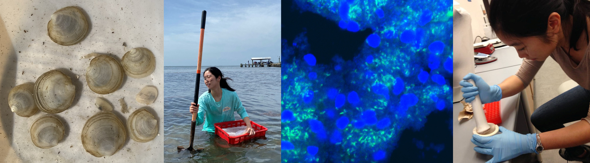

# The microbial ecology lab
**Shen Jean Lim | [Home](https://shenjean.github.io) | [Biography](bio.md) | [Publications](pubs.md) | [News](news.md) | [Lab Manual](lab.md) | [Contact](contact.md) | [Protocols](protocols.md)**

The microbial ecology lab studies host-microbe-environment interactions in marine ecosystems and in humans. 
We integrate field, laboratory, and ‘omics approaches to understand the interplay between microbes (bacteria, viruses, and fungi), host health, and environmental health. Volunteers, collaborators, and fellowship applications are welcome!
