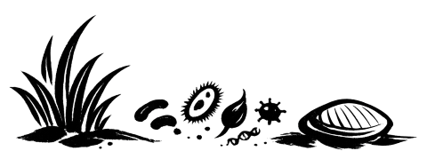
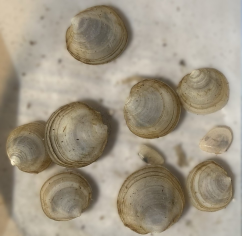

# Landscape of Interacting Microbes - LIM lab
**LIM lab | [Home](https://shenjean.github.io) | [Biography](bio.md) | [Publications](pubs.md) | [News](news.md) | [Lab Manual](lab.md) | [Contact](contact.md) | [Protocols](protocols.md)**

The microbial ecology lab studies host-microbe-environment interactions in marine ecosystems and in humans. 
We integrate field, laboratory, and ‘omics approaches to understand the interplay between microbes (bacteria, viruses, and fungi), host health, and environmental health. Volunteers, collaborators, and fellowship applications are welcome!

## Currently funded project
| 2026-2027 | Investigating the feasibility of co-restoration of seagrass and native clams in Florida | 
| --------- | --------------------------------------------------------------------------------------- |
|  | This project investigates the microbial diversity in Florida's seagrass habitats in association with lucinid bivalve (clam) abundance, beneficial bacteria (symbionts), nutrient composition, and seagrass health. Results will inform the development of a novel, scalable strategy and a best practices guide for seagrass-clam co-restoration.

