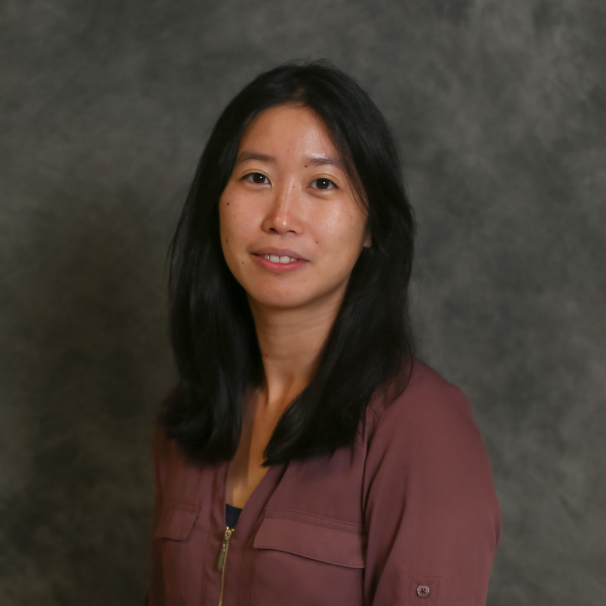
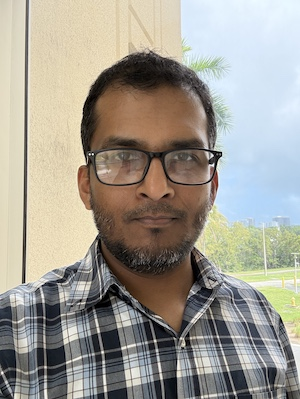

# Landscape of Interacting Microbes - Shen Jean Lim
**LIM lab | [Home](https://shenjean.github.io) | [People](bio.md) | [Publications](pubs.md) | [News](news.md) | [Lab Manual](lab.md) | [Contact](contact.md) | [Protocols](protocols.md)**

## Shen Jean Lim, Ph.D., Assistant Professor

>My research centers on characterizing host-microbe-environment interactions in marine ecosystems. I integrate field, laboratory, and ‘omics approaches to understand the interplay between microbes (bacteria, viruses, and fungi), host health, and environmental health. On-going projects include 1) the interactions of chemosymbiotic lucinid bivalves with their gill symbionts, environmental microorganisms, and surrounding seagrasses; and 2) viruses, bacteria, and phytoplankton associated with <i>Karenia brevis</i> (red tide) blooms in Florida.

>When I'm not in the lab, I enjoy being outdoors. I have been swimming, biking, and running in Florida and participated in local triathlon, half marathon, and other events. I also enjoy hiking and scuba diving. 

#### Education
| Year | Degree |	 Institution |
| ------ | -------- | -------- | 
| 2018 |	Ph.D in Microbiology |	Clemson University ([Dissertation](https://open.clemson.edu/all_dissertations/2566/)) |
| 2012 | M.Sc. in Biochemistry | National University of Singapore ([Dissertation](https://scholarbank.nus.edu.sg/handle/10635/30289)) |
| 2008 | B.Sc. (Hons) in Life Sciences - Molecular Cell Biology |	National University of Singapore |

#### Professional Experience 
| Year | Position |	Institution |
| ------ | -------- | -------- | 
| 2026 - present | Assistant Professor | Department of Biological Sciences, Florida International University |
| 2022-2025 |		Scientific Researcher | College of Marine Science, University of South Florida |
| 2020-2022	|	Postdoctoral Associate | Cooperative Institute for Marine and Atmospheric Studies, University of Miami |
| 2019-2020	|	Postdoctoral Scholar | College of Nursing, University of South Florida |
| 2019 |		Postdoctoral Scholar | Biological Sciences Department, Vanderbilt University |

#### Teaching
| Semester | Class |
| ------ | -------- | 
| Fall 2026 | Microbial Ecology |

## Mir Alvee Ahmed, Ph.D., Postdoctoral Associate

 
> I am interested in how microbial communities shape and respond to marine and estuarine environments. My work focuses on understanding microbial composition and interactions within ecosystems, as well as the environmental drivers that influence their activity and growth, with broader implications for ecosystem function and human health. I earned my Ph.D. in Microbiology from Clemson University, where, under the supervision of Dr. Barbara J. Campbell, I studied microbial ecology in the Chesapeake and Delaware Bays using genome-resolved metagenomics and metatranscriptomics.
Currently, I am working with Dr. Shen Jean Lim at FIU, focusing on the microbial ecology of seagrass- and clam-associated communities. This work includes field sampling in coastal areas and the Florida Keys, along with controlled aquarium experiments to investigate microbial activities.

> Outside of research, I enjoy long walks, gardening, and browsing old bookshops in search of hidden gems. | 

#### Education
| Year | Degree |	 Institution |
| ------ | -------- | -------- | 
| 2025 | Ph.D. in Microbiology | Clemson University |
| 2013 | M.S. in Microbiology | Jahangirnagar University, Bangladesh |
| 2011 | B.Sc. (Honors) in Microbiology | Jahangirnagar University, Bangladesh |

#### Professional Experience 
| Year | Position |	Institution |
| ------ | -------- | -------- | 
| 2025-2026 | Research Assistant (Voluntary) | Clemson University |
| 2018-2025 | Graduate Teaching Assistant | Department of Biological Sciences, Clemson University |
| 2018 | Senior Research Officer | Environmental Microbiology Laboratory, icddr,b |
| 2014 – 2018 | Research Officer | Environmental Microbiology Laboratory, icddr,b  |
| 2013 – 2014 | Research Officer | Center for Communicable Diseases, icddr,b |

#### Teaching
Courses taught: General Microbiology Laboratory; Industrial Microbiology Laboratory; Practical Bioinformatics for Microbiologists

