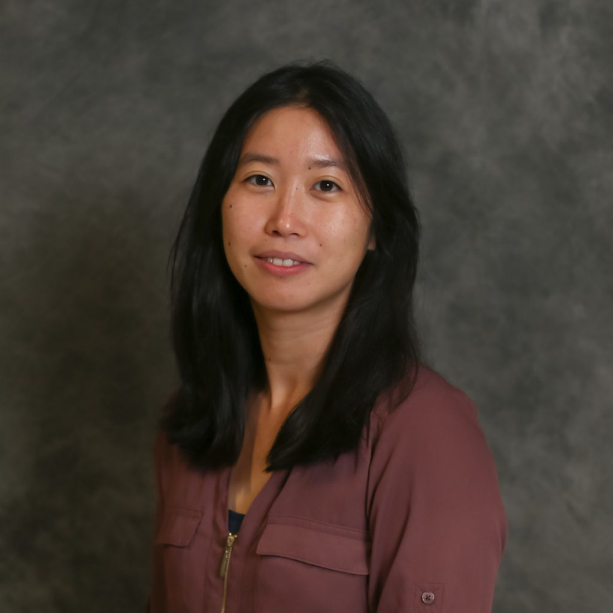
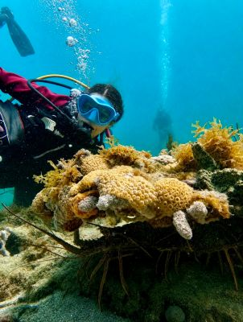
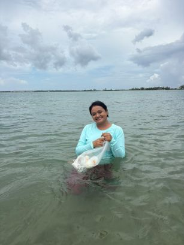
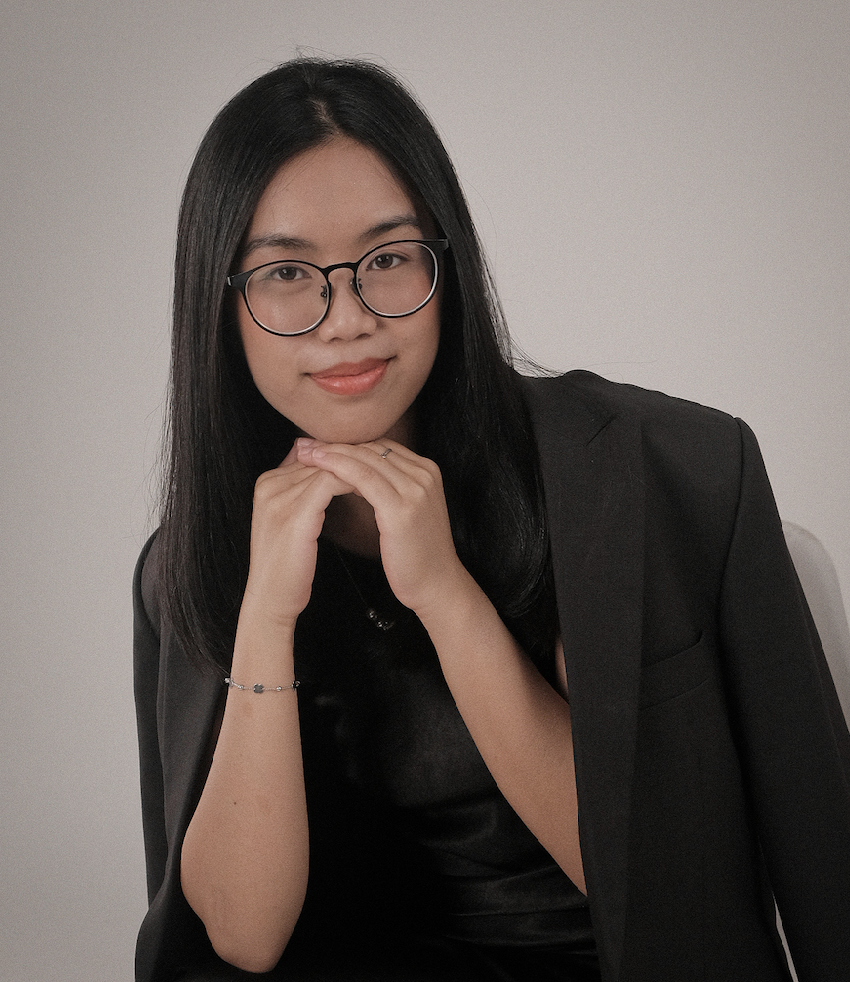

# Landscape of Interacting Microbes - Lab Members
**LIM lab | [Home](https://shenjean.github.io) | [People](bio.md) | [Publications](pubs.md) | [News](news.md) | [Lab Manual](lab.md) | [Contact](contact.md) | [Protocols](protocols.md)**

## Current Lab Members

| Name | Role |
| ---- | ---- |
| Dr. Shen Jean Lim | Assistant professor and lab PI |
| Shira Jaye Anteby-Maleh | Research assistant |
| Israt Sultana Isha | Graduate student |
| Thao Phuong Tran | Undergraduate research assistant | 

## Lab Alumni

| Name | Role |
| ---- | ---- |
| Dr. Mir Alvee Ahmed (2026) | Now visiting faculty at University of Pittsburg at Bradford |
| Alison Coykendall (2026) | REU student from Fort Hays State University | 

## Shen Jean Lim, Ph.D., Assistant Professor

>My research centers on characterizing host-microbe-environment interactions in marine ecosystems. I integrate field, laboratory, and ‘omics approaches to understand the interplay between microbes (bacteria, viruses, and fungi), host health, and environmental health. On-going projects include 1) the interactions of chemosymbiotic lucinid bivalves with their gill symbionts, environmental microorganisms, and surrounding seagrasses; and 2) viruses, bacteria, and phytoplankton associated with <i>Karenia brevis</i> (red tide) blooms in Florida.

>When I'm not in the lab, I enjoy being outdoors. I have been swimming, biking, and running in Florida and participated in local triathlon, half marathon, and other events. I also enjoy hiking and scuba diving. 

#### Education
- 2018: Ph.D in Microbiology, Clemson University ([Dissertation](https://open.clemson.edu/all_dissertations/2566/))
- 2012: M.Sc. in Biochemistry, National University of Singapore ([Dissertation](https://scholarbank.nus.edu.sg/handle/10635/30289))
- 2008: B.Sc. (Hons) in Life Sciences - Molecular Cell Biology, National University of Singapore

#### Professional Experience 
- 2026 - present: Assistant Professor, Department of Biological Sciences, Florida International University
- 2022-2025: Scientific Researcher, College of Marine Science, University of South Florida
- 2020-2022: Postdoctoral Associate, Cooperative Institute for Marine and Atmospheric Studies, University of Miami
- 2019-2020: Postdoctoral Scholar, College of Nursing, University of South Florida
- 2019: Postdoctoral Scholar, Biological Sciences Department, Vanderbilt University

#### Teaching
Fall 2026: MCB4603/MCB5605 | Microbial Ecology 

## Shira Jaye Anteby-Maleh, M.S., Research Assistant

>Shira is a Research Assistant in the Microbial Ecology lab researching bacterial diversity in seagrass, sediments, Lucinidae bivalves, and various environmental samples on the Atlantic and Gulf Coasts of Florida. Techniques include DNA extraction, 16S rRNA gene and metatranscriptomic sequencing, and translational analysis in order to study the effects of lucinid density and transplantation, microbial symbionts, seagrass biomass, and nutrient cycling on seagrass-microorganism co-restoration. Shira has her MS in Biological Sciences from Nova Southeastern University Oceanographic Center in Dania Beach and her BA in Biology from Hofstra Univesity in Hempstead, NY. Shira is also an avid scuba diver and has her Advanced Open Water, Nitrox, and Rescue Diver certifications, and is working towards her Scientific Diver in the future. 

## Israt Sultana Isha, Ph.D. student

>I grew up along the coast of Chittagong, Bangladesh, so the ocean was never just something I studied in a textbook-it was always part of the world around me. That early connection eventually turned into a passion and I went on to complete both my B.Sc. and M.S. in Oceanography at the University of Chittagong, Bangladesh.

> My research experiences have taken me into the field to collect seawater, sediment, seaweed, and bivalve samples, as well as into data analysis and laboratory work. I have also explored marine science through workshops in benthic imagery, BRUV sampling, data science and machine learning with Python. These experiences helped me appreciate how field observations, data and biology come together to tell the story of an ecosystem.

>I’m particularly interested in lucinid clams and their fascinating microbial partnerships, seagrass-microbiome interactions, blue carbon, and how environmental stressors can change microbial communities and ecosystem health.

> One of my favorite things about the ocean is that there is always a “wow” moment-whether it’s discovering unexpected organisms in a sample, seeing patterns emerge from field data, or realizing that a tiny microbe may be doing something incredibly important for its host and the surrounding environment. 

> Outside of research, I enjoy learning new things, dancing, meeting people from different backgrounds, and exploring new places. I have also been involved in science and community outreach through organizations including UNICEF and the SDG Youth Forum. 

## Thao Phuong Tran, undergraduate research assistant

>I am an undergraduate student at FIU on the pre-nursing track and will be starting the FIU Nursing Program in Spring 2027. I enjoy working in the lab and learning new techniques, especially skills that can connect to and support my future journey in healthcare. I have experience with techniques such as DNA extraction and look forward to gaining more hands-on research experience. Outside of school and the lab, I enjoy playing piano and challenging myself to cook different Asian dishes in my free time.
