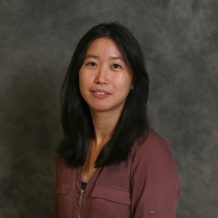

# The microbial ecology lab - About me 
**Shen Jean Lim | [Biography](bio.md) | [Publications](pubs.md) | [Contact](contact.md)**

## Education

- 2018	Ph.D in Microbiology,	Clemson University ([Dissertation](https://open.clemson.edu/all_dissertations/2566/))
- 2012	M.Sc. in Biochemistry,	National University of Singapore ([Dissertation](https://scholarbank.nus.edu.sg/handle/10635/30289))
- 2008	B.Sc. (Hons) in Life Sciences - Molecular Cell Biology,	National University of Singapore 

## Professional Experience 

- 2022-2025		Scientific Researcher,	College of Marine Science, University of South Florida
- 2020-2022		Postdoctoral Associate, Cooperative Institute for Marine and Atmospheric Studies, University of Miami
- 2019-2020		Postdoctoral Scholar,	College of Nursing, University of South Florida
- 2019		Postdoctoral Scholar, Biological Sciences Department, Vanderbilt University

## Teaching

#### University of South Florida

- Guest instructor,	Biological Oceanography lab for graduate students 
- Guest lecturer, General Microbiology 
- Guest lecturer, Marine Ecology

#### Clemson University
- Guest lecturer, Microbial Diversty and Ecology 
- Guest lecturer, Marine Microbiology 
- Guest instructor,	Practical Bioinformatics for Microbiologists 
- Guest lecturer,	Microbial Diversity and Ecology 
- Teaching assistant, Introduction to Microbiology lab 
- Teaching assistant, Cell Biology lab

#### National University of Singapore
- Teaching assistant, Bioinformatics and Biocomputing lab 
- Teaching assistant, Introductory Bioinformatics lab 

## Community Involvement/Outreach 

-	Mentor, ASM Future Leaders Mentoring Fellowship. American Society of Microbiology (ASM; 2023-2024).
-	Letters to a Pre-Scientist (one sixth grade pen pal; 2022)
-	Skype-a-Scientist (completed five sessions; 2020-2023)
-	Mentor, Ocean Sciences Meeting (mentored three graduate students; 2022)

