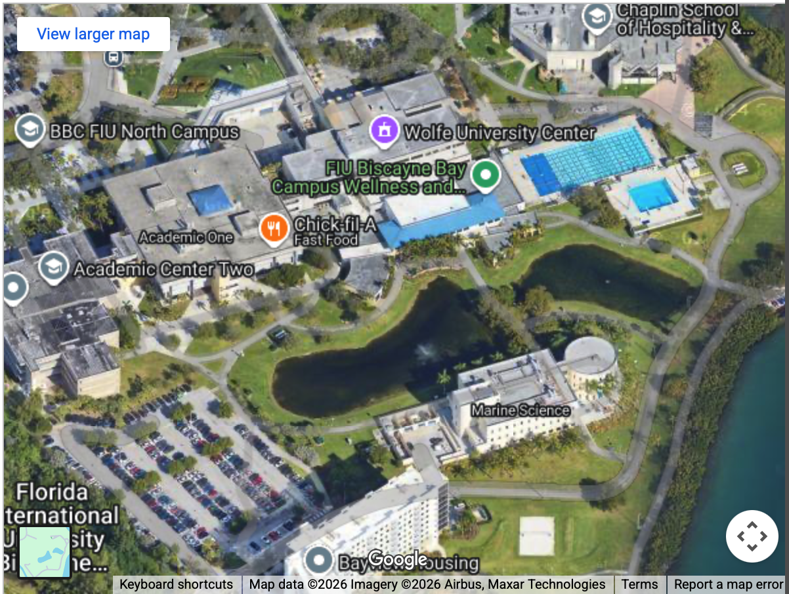

# Landscape of Interacting Microbes - Contact us
**LIM lab | [Home](https://shenjean.github.io) | [Biography](bio.md) | [Publications](pubs.md) | [News](news.md) | [Lab Manual](lab.md) | [Contact](contact.md) | [Protocols](protocols.md)**

[View map](https://maps.app.goo.gl/1Qm42hMvQqBSFGhi7)

**Office:**  Room 250G, 3000 NE 151st ST, Marine Science Building, Miami, Florida 33181

**Lab:** Room 351, 3000 NE 151st ST, Academic Center Two (AC2), Miami, Florida 33181

**Phone:** 305-919-4100

**E-mail:** shlim [at] fiu [dot] edu

🦠 The microbial ecology lab believes that everyone can be a scientist, and that there are various ways to be successful in science (academia and non-academia). While I don’t have the answers to all problems in science, my greatest satisfaction from teaching and mentoring is from knowing that I have piqued my students’ curiosity and interest in science, and that I have empowered them to seek the answers they need. The lab welcomes scientists and students who are creative and motivated problem-solvers passionate about answering questions related to microbial ecology and OneHealth.

📢 Currently, I am recruiting one postdoc/lab technician from March 2026 to March 2027. I will also be happy to discuss and develop proposals with other scientists and with prospective local and international graduate students and postdocs. 

📬 If interested, please contact me and include the following:
- Your CV/Resume 
- Statement of research interests and career goals
