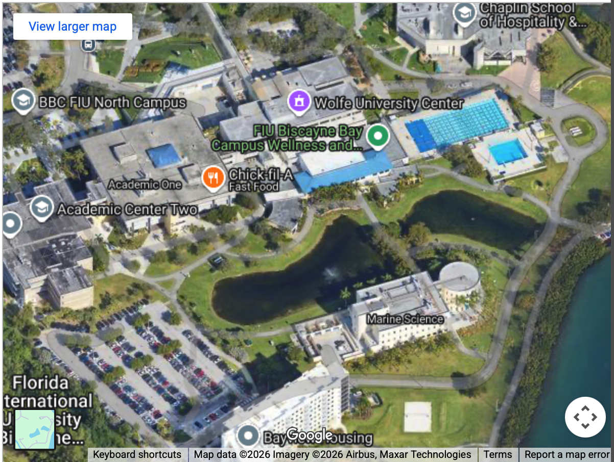

# Landscape of Interacting Microbes - Contact Us
**LIM lab | [Home](https://shenjean.github.io) | [People](bio.md) | [Publications](pubs.md) | [News](news.md) | [Lab Manual](lab.md) | [Contact](contact.md) | [Protocols](protocols.md)**

[View map](https://maps.app.goo.gl/1Qm42hMvQqBSFGhi7)

**Office:**  Room 250G, 3000 NE 151st ST, Marine Science Building, Miami, Florida 33181

**Lab:** Room 351, 3000 NE 151st ST, Academic Center Two (AC2), Miami, Florida 33181

**Phone:** 305-919-4100

**E-mail:** shlim [at] fiu [dot] edu

