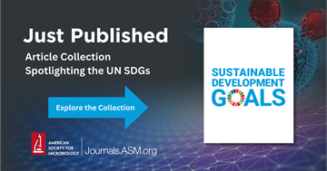

# The microbial ecology lab - Publications
**Shen Jean Lim | [Biography](bio.md) | [Publications](pubs.md) | [News](news.md) | [Contact](contact.md) | [Protocols](protocols.md)**

## :books: Book Chapters
Mentee(s) highlighted in **bold**
- <u>Lim, S.J.</u> & **Young, M.N.** (2024) Genome annotation: perspective from bacterial genomes. In [Reference Module in Life Sciences, Elsevier](https://doi.org/10.1016/B978-0-323-95502-7.00256-6)
- <u>Lim, S.J.</u> (2024) Mapping the environmental microbiome. In [Reference Module in Life Sciences, Elsevier](https://doi.org/10.1016/B978-0-323-95502-7.00242-6)
- <u>Lim, S.J.</u>, Khan, A.M., De Silva, M., Lim, K.S., Hu, Y., Tan, C.H. & Tan, T.W. (2011) Integration of e-learning tools with the problem-based learning approach to enhance teaching and learning in undergraduate bioinformatics modules. In Technology in Higher Education: The State of the Art [E-Publication Volume], p.63-79.
- Tong, J.C. & <u>Lim, S.J.</u> (2010) Computational epigenetics. In [Encyclopedia of Molecular Cell Biology and Molecular Medicine, 3rd ed., Meyers, Bob. Wiley.](https://doi.org/10.1002/3527600906.mcb.201100012)

## 📰 Refereed Journal Articles
Mentee(s) highlighted in **bold**

### 2025
- Couradeau E., Martiny J.B.H, ... <u>the Microbiomes for One Health Initiative</u>. Incorporating microbiomes into the One Health Joint Plan of Action. [mBio 0:e01456-25](https://doi.org/10.1128/mbio.01456-25)
- Young, M., Natarajan, O., <u>Lim, S.J.</u>, Dishaw L.J. *Pseudovibrio ascidiaceicola* 5337, a marine bacterial symbiont of the ascidian gut with unusual genome features. [Microbiol. Resour. Announc. 0:e00594-25](
https://doi.org/10.1128/mra.00594-25)
- Giani, N.M., <u>Lim, S.J.</u>, Anderson, L.C., Paterson, A.T., Engel, A.S., Campbell, B.J. (2025) Variation in accessory and horizontal gene transfer-associated genes drives lucinid endosymbiont diversity, [FEMS Microbiology Ecology 101(8):fiaf074](https://doi.org/10.1093/femsec/fiaf074)
- <u>Lim, S.J.</u>, **Rogers, A.**, Rosario, K., Kerr, M., Garrett, M., Koester, J., Hubbard, K.A., Breitbart, M. (2025) Diverse ssRNA viruses associated with <i>Karenia brevis</i> harmful algal blooms in Southwest Florida, [mSphere 10:e01090-24](https://doi.org/10.1128/msphere.01090-24)
  > This article is included in ASM's Sustainable Development Goals (SDG) Spotlight collection

-	Anderson, L.C., Campbell, B., Long-Fox, B., Petersen, J., <u>Lim, S.J.</u> … Aquatic Symbiosis Genomics Project Leadership (2025) The genome sequence of the woven lucine, <i>Lucinisca nassula</i> (Conrad, 1846), [Wellcome Open Res., 10:225](https://wellcomeopenresearch.org/articles/10-225)
- Natarajan, O., Gibboney, S.L., Young, M.N., <u>Lim, S.J.</u>, Nguyen, F., Pluta, N., Atkinson, C.G.F., Liberti, A., Kees, E.D., Leigh, B.A., Breitbart, M., Gralnick, J.A. & Dishaw, L.J. (2025) Prophages regulation of <i>Shewanella fidelis</i> 3313 motility and biofilm formation: implications for gut colonization dynamics in <i>Ciona robusta</i>, [eLife, 14:RP103107](https://doi.org/10.7554/eLife.103107.2)

### 2024
- <u>Lim, S.J.</u>, Rosario, K., Kernbach, M.E., Gross, A.J., Furman, Bradley T. & Breitbart, M. (2024) Limited potexvirus diversity in eastern Gulf of Mexico seagrass meadows, [Journal of General Virology, 105(6): 002004](https://doi.org/10.1099/jgv.0.002004). 
- Charon, J., Olendraite, I., …, <u>Lim, S.J.</u>, …, Neri, U. (2024) Consensus statement from the first RdRp Summit: advancing RNA virus discovery at scale across communities, [Frontiers in Virology, 4 - 2024](https://doi.org/10.3389/fviro.2024.1371958)
  
### 2023
- **Park, H.**, <u>Lim, S.J.</u>, Cosme, J., O'Connell, K., Sandeep, J., Gayanilo, F., Cutter, G.R., Montes, E., Nitikitpaiboon, C., Fisher, S., Moustahfid, H, & Thompson, L.R. (2023) Investigation of machine learning algorithms for taxonomic classification of marine metagenomes, [Microbiology spectrum, 11:e05237-22](https://doi.org/10.1128/spectrum.05237-22) 
- Gonzalez-Mercado, V.J., <u>Lim, S.J.</u> & Aouizerat, B. (2023) Insights from bacterial 16S rRNA gene into bacterial genera and predicted metabolic pathways associated with stool consistency in rectal cancer patients: a proof of concept, [Biological Research for Nursing, 25(3):491-500](https://doi.org/10.1177/10998004231159623)
- <u>Lim, S.J.</u>, Jithpratuck, W., Wasylik, K., Sriaroon, P. & Dishaw, L.J. (2023) Associations of microbial diversity with age and other clinical variables among pediatric chronic rhinosinusitis (CRS) patients, [Microorganisms, 11(2), 422](https://doi.org/10.3390/microorganisms11020422)
- <u>Lim, S.J.</u>, Thompson, L.R. & Goodwin, K.D. (2023) Genetic features of the marine polychaete <i>Sirsoe methanicola</i> from metagenomic data, [Frontiers in Marine Science, 9:1067482](https://doi.org/10.3389/fmars.2022.1067482) 
- <u>Lim, S.J.</u>, Thompson, L.R., Young, C.M., Gaasterland & Goodwin, K.D. (2022) Dominance of <i>Sulfurospirillum</i> in metagenomes associated with the methane ice worm (<i>Sirsoe methanicola</i>), [Applied and Environmental Microbiology, 88(15): e0029022](https://doi.org/10.1128/aem.00290-22) (spotlight selection)

### 2022
-	Thompson, L.R., Anderson, S.R., DenUyl, P.A., Patin, N.V., <u>Lim, S.J.</u>, Sanderson, G., Goodwin, K.D. (2022) Tourmaline: a containerized workflow for rapid and iterable amplicon sequence analysis using QIIME 2 and Snakemake, [GigaScience, 11: giac066](https://doi.org/10.1093/gigascience/giac066)

### 2021
- Gonzalez-Mercado, V.J., <u>Lim, S.J.</u>, Yu, G., Penedo, F., Pedro, E., Bernabe, R., Tirado-Gómez, M. & Aouizerat, B. (2021) Co-occurrence of symptoms and gut microbiota composition before neoadjuvant chemotherapy and radiation therapy for rectal cancer: a proof of concept, [Biological Research for Nursing, 23(3): 513-523](https://doi.org/10.1177/1099800421991656)
- Gonzalez-Mercado, V.J., <u>Lim, S.J.</u>, Saligan, L., Sarkar, A., Perez, N., Rodriguez, C., Bernabe, R., Dutra, S.V.O., Pedro, E., Sepehri, F. & Aouizerat, B. (2021) Gut microbiota and depressive symptoms at the end of neoadjuvant chemotherapy and radiation therapy for rectal cancer: a cross-sectional pilot study, [Depression Research and Treatment, 2021:7967552](https://doi.org/10.1155/2021/7967552) 
- Ahmed, M.A., <u>Lim, S.J.</u> & Campbell, B.J. (2021) Metagenomes, metatranscriptomes and metagenome-assembled genomes (MAGs) from Chesapeake and Delaware Bay (USA) water samples, [Microbiology Resource Announcements, 10(21): e0026221](https://doi.org/10.1128/mra.00262-21)
 - <u>Lim, S.J.</u>, **Davis, B.G.**, **Gill, D.E.**, Swetenburg, J., Anderson, L.C., Engel, A.S. & Campbell, B.J. (2021) Gill microbiome structure and function in the chemosymbiotic coastal lucinid <i>Stewartia floridana</i>, [FEMS Microbiology Ecology, 97(4): fiab042](https://doi.org/10.1093/femsec/fiab042)
- <u>Lim, S.J.</u>, & Thompson, L.R. (2021) Mitohelper: A mitochondrial reference sequence analysis tool for fish eDNA studies, [Environmental DNA, 3: 706-715](https://doi.org/10.1002/edn3.187)
  > GitHub repository: [https://github.com/aomlomics/mitohelper](https://github.com/aomlomics/mitohelper) | 
  > Datasets: 
- <u>Lim, S.J.</u>, Aguilar-Lopez, M., Wetzel, C., Dutra, S.V.O, Bray, V., Groer, M.W., Donovan, S.M. & Ho, T. (2021) The effects of genetic relatedness on the preterm infant gut microbiota, [Microorganisms, 9(2):278](https://doi.org/10.3390/microorganisms9020278)
- Gonzalez-Mercado, V.J., <u>Lim, S.J.</u>, Marrero, S.J., Pedro, E. & Saligan, L.N. (2021) Gut microbiota and fatigue in rectal cancer patients: a cross-sectional pilot study, [Supportive Care in Cancer, 29:4615-4621](https://link.springer.com/article/10.1007/s00520-021-06013-2)

### 2020
 - <u>Lim, S.J.</u>, Seyfang, A., Dutra, S.V.O., Kane, B. & Groer M. (2020) Gene expression responses to Zika virus infection in peripheral blood mononuclear cells from pregnant and non-pregnant women. [MicrobiologyOpen, 9(12): e1134](https://doi.org/10.1002/mbo3.1134)
- Oberstaller, J., Gibbons, J., …, <u>Lim, S.J.</u>, …, Jiang, R.H.Y. (2020) OneHealth codeathon of host-microbiome interactions - a novel approach integrating social sciences and data sciences, [F1000 Research, 9(1478): 1478](https://doi.org/10.12688/f1000research.26459.1)
-	Gonzalez-Mercado, V.J., Henderson, W., Sarkar, A., <u>Lim, S.J.</u>, Saligan, L.N, Berk, L.; Dishaw, L., McMillan, S., Groer, M., Sepehri, F. & Melkus, G. (2020) Changes in gut microbiome associated with co-occurring symptoms development during chemo-radiation for rectal cancer: a proof of concept study. [Biological Research for Nursing, 23(1):31-41](https://doi.org/10.1177/1099800420942830)
- Gonzalez-Mercado, V.J., <u>Lim, S.J.</u>, Berk, L., Esele, M., Rodriguez, C. & Colon-Otero, G. (2020) Gut microbiota differences in island Hispanic Puerto Ricans and mainland non-Hispanic whites during chemo-radiation for rectal cancer: a pilot study. [Current Problems in Cancer, 10051](http://dx.doi.org/10.1016/j.currproblcancer.2020.100551)

### 2018-2019
 - <u>Lim, S.J.</u> & Bordenstein, S.R. (2019) An introduction to phylosymbiosis. [Proceedings of the Royal Society B, 287: 20192900](https://doi.org/10.1098/rspb.2019.2900)

- <u>Lim, S.J.</u>, **Alexander, L.**, Engel, A.S., Paterson, A.T., Anderson, L.C. & Campbell, B.J. (2019) Extensive thioautotrophic endosymbiont species diversity within a single Ctena orbiculata (Bivalvia:Lucinidae) population. [mSystems, 4:e00280-19](https://doi.org/10.1128/msystems.00280-19) 

- <u>Lim, S.J.</u>, **Davis, B.G.**, **Gill, D.E.**, **Walton, J.**, **Nachman, E.**, Engel, A.S., Anderson, L.C. & Campbell, B.J. (2018) Taxonomic and functional heterogeneity of the gill microbiome in a symbiotic coastal mangrove lucinid species. [ISME J, 13: 902-920](https://www.nature.com/articles/s41396-018-0318-3) 

### 2009-2012
- Wee, L.J., <u>Lim, S.J.</u>, Ng, L.F. & Tong, J.C. (2012) Immunoinformatics: how in silico methods are re-shaping the investigation of peptide immune specificity. [Front Biosci (Elite Ed), 4:311-9](https://doi.org/10.2741/e378)
- <u>Lim, S.J.</u>, Tan, T.W. & Tong, J.C. (2010) Computational epigenetics: the new scientific paradigm. [Bioinformation, 4(7): 331 337](https://doi.org/10.6026/97320630004331) 
- Song, C.M., <u>Lim, S.J.</u> & Tong, J.C. (2009) Recent advances in computer-aided drug design. [Briefings in Bioinformatics, 10(5): 579 91](https://doi.org/10.1093/bib/bbp023) 
- Tong, J.C., <u>Lim, S.J.</u> Muh, H.C., Chew, F.T. & Tammi, M.T. (2009) Allergen Atlas: a comprehensive knowledge center and analysis resource for allergen information. [Bioinformatics, 25(7): 979 80](https://doi.org/10.1093/bioinformatics/btp077) 

